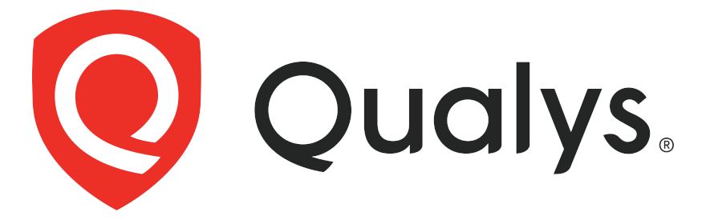

# OIDC and CICD: Why Your CI Pipeline Is Your Greatest Security Threat

<div class="titlecolumns">
<div class="presenters">

<!-- https://www.usenix.org/conference/srecon24americas/presentation/hahn -->

 Ted Hahn, 
thahn@tcbtech.com

<!-- Ted Hahn is an SRE for hire working on planet-scale distributed systems. His clients include Epic Games and startups in Seattle and New York. -->

 Mark Hahn, 
mhahn@qualys.com

<!-- Mark Hahn is a Security Solutions Architect for Cloud and Containers at Qualys. He works on securing cloud native environments for the most demanding customers worldwide. -->

</div>
<div>

<br><br>

## [tcbtech.com/oidc-cicd](https://tcbtech.com/oidc-cicd)

</div>

</div>

<!-- Project repo: https://github.com/tcbtechnologies/odic-cicd/ -->

<!-- We are father son team that put this idea and demonstration together. 

We encourage you to open the slides at this URL while we talk

-->

---
# OIDC and CICD: Why Your CI Pipeline Is Your Greatest Security Threat

<!-- https://www.usenix.org/conference/srecon24americas/presentation/hahn -->

 Ted Hahn, 
thahn@tcbtech.com

<!-- Ted Hahn is an SRE for hire working on planet-scale distributed systems. His clients include Epic Games and startups in Seattle and New York. -->

 Mark Hahn, 
mhahn@qualys.com

<!-- Mark Hahn is a Security Solutions Architect for Cloud and Containers at Qualys. He works on securing cloud native environments for the most demanding customers worldwide. -->

## [tcbtech.com/oidc-cicd](https://tcbtech.com/oidc-cicd)

<!-- Project repo: https://github.com/tcbtechnologies/odic-cicd/ -->

<!-- We are father son team that put this idea and demonstration together. 

We encourage you to open the slides at this URL while we talk

-->

---
<style scoped>
{
  font-size: 150%;
}
</style>
# Configuring your CI correctly is vital

- Outline:
  - History of credentials
  - Why using long lived tokens is insecure
  - Examples of what can go wrong
- How to use OIDC
  - Create the roles in your infra (AWS, Kube Clusters)
  - Setup pipelines to use OIDC
  - Section off privileges into roles attached to branches
- Examples using OIDC:
  - Create OIDC Providers permissions in AWS (also GCP and Azure, if there is time)
  - Configure GitHub (And CircleCI, Gitlab)
  - Run a pipeline and see identity (and changing by pipeline stage)

---
# History of Credentials

- Manually entered for builds that ran by hand
- Automated builds
- Access tokens
- SAML / SAML-Like
- OAuth2
- OIDC

<!--
-- Mark --

In the not-too-distant past, builds were mostly independent and offline. Build servers were manually configured with the necessary libraries; Very few credentials were used at all. If there was a signing key, it was generated by hand on the machine and the public key was signed offsite. Artifacts were stored on machine.  

Then there was a moved to automation with tools like Hudson, Jenkins and other tools.

Access Tokens are straightforward and hard to screw up, but are long-lived credentials that **spend their time waiting to be leaked**. Rotation schedules are key, and while they're easy enough to rotate, it is usually hard to automate and manual work to deal with these rotations, creating ops churn.Few systems support multiple tokens with overlapping validity (i.e. the ability to create a new credential without immediately invalidating the old), which is useful for automation.

At some point, enterprises adopted SAML, which we have nothing nice to say about, so we'll say as little as possible. It works but it's complex and easy to screw up.  

-- Ted --

OAuth2 is a protocol for handling authenticaion, but does not go very far - It doesn't specify what you're autenticating, just the flow. OIDC is an opinionated protocol on top of Oauth2.

We use OIDC only incidentally - It is presently the one and only common way that you can connect two vendors by allowing you to convert one authenticaion token into another. In this it is hugely powerful to our security goals - But similar schemes could be implemented on top of other protocols.

-->

---
# Why long lived credentails are insecure

Well, duh!
- No rotation
- Coarse grained access
- Poor attribution to the user initiating an action

<!-- 
-- Mark --

This speaks for itself. Long lived credentials are likely shared between a bunch of people or a bunch of teams. 

They're fine for getting started (because they are easy), but we've shown that security breaches do happen, and it's painful to rotate if you're not in the habit of rotating.

-->

---
# What can go wrong

- Secrets can leak easily!
```
echo $CLOUD_SECRET | base64
```

- Vendors can leak secrets - CircleCI had a leak in 2023
"We recommended that all customers rotate their secrets, including OAuth tokens, Project API Tokens, SSH keys, and more"

- Vendors can get hacked via CICD - CloudFlare Thanksgiving Day 2023 Incident

<!-- 
-- Ted --

CircleCI had a security breach in January of 2023 that potentially allowed the attackers to read all of their secrets. Any AWS Access tokens stored in there, for example, could be used and abused to upload malicious artifacts, to access internal or third party systems, to download source code or propietary data. You should not treat your source code as secret - But neither should you give it away.

For many CircleCI Customers, these secrets were "set and forget"; Most customers did not know how these credentials were created in the first place, and so didn't know how to re-create them for rotation, nor how to disable the old ones. In many cases, the access was overprovisioned - Giving these CI Secrets access to S3 buckets not just containing build artifacts or public websites, but also acess to business internal data or internal services.

We were unable to find any public reports of secondary breaches from this, but the potential implications were high.

-->

---
# How to use OIDC

Three Simple Steps:
-  Create Roles in your Cloud
-  Setup pipelines to use OIDC
-  Section off privileges into roles attached to branches

<!--
-- Mark --

These steps are simple, but take some trial and error. 

Testing via shell may help.

-->
---
# Create the roles in your infra (AWS, Kube Clusters)
Create roles that provide the access you need
Setup the policies/permissions that to the least privileges necessary

<!--
-- Ted --

    This is the hard part, not because it's hard, but because it's fiddly and you will bang your head against it. Pay careful attention to the claims (you can inspect the JWT that Gitlab or Github generates). The saudience and subject need to match precisely; Capitalization matters.

See our example repository for the precise, working invocations.

-->

---
# For Example
```
    Statement = [
      {
        Action = "sts:AssumeRoleWithWebIdentity"
        Effect = "Allow"
        Sid    = "Github"
        Principal = {
          Federated = aws_iam_openid_connect_provider.circleci.arn
        }
        Condition = {
          "StringEquals" : {
            "token.actions.githubusercontent.com:aud" : "sts.amazonaws.com",
          },
	•  •  •
```
<!--
-- Ted --

-->
---
# Setup pipelines to use OIDC

Create the OIDC token in your pipeline
Using the pipeline syntax for your provider
(they just create them)

```
    - name: Configure AWS credentials from Test account
      uses: aws-actions/configure-aws-credentials@v4
      with:
        role-to-assume: arn:aws:iam::783153433147:role/github-actions
        aws-region: us-east-1
```

<!--

-- Mark --

It's not that hard, and there's simple recipes. Github Actions has official "Actions" that you can use, Gitlab requires a little bit of configuration.

https://docs.gitlab.com/ee/ci/secrets/id_token_authentication.html
- ACTIONS_ID_TOKEN_REQUEST_TOKEN
- ACTIONS_ID_TOKEN_REQUEST_URL

-->

---
# OIDC Token Example

```
{
  "aud": "sts.amazonaws.com"
  "sub": "project_path:tcbtech/oidc-talk:ref_type:branch:ref:mark",
  "iss": "https://gitlab.com",
  "iat": 1705018870,
  "nbf": 1705018865,
  "exp": 1705022470,

  "namespace_id": "8163212",
  "namespace_path": "tcbtech",
  "project_id": "53428581",
  "project_path": "tcbtech/oidc-talk",
   . . . 
```

<!--
-- Ted --
Scope, Iss, sub, etc.
Not before, expiration, and all the stuff that is needed for strong validation . . . 
-->

---
# Section off privileges into roles attached to branches

Setup the roles or service accounts
Attach them to the proper policies and permissions
Attach them to branches

<!--
-- Mark --

Least-privilege is important - See examples like the [Capital One Cyberattack](https://dl.acm.org/doi/10.1145/3546068)

Least-privilege is easy unless you make it hard. You add prviledges one by one or in small batches until it works, then stop. Get in the habit of adding new privileges and adding new roles for each new action you're doing.

Don't go overboard - Use real distinctions. You don't need a role for every pull request; Just a role for each protected branch, and a role for "all other branches". If you have a complicated pipeline, you may also split out on pipeline stage - Your terraform runner stage may have the ability to apply changes to RDS instances, for example, but not to push ECR images, while your docker build has permissions into the artifacts S3 bucket and ECR permissions. Don't let combinatorial explosion happen, but do use automation to make the cross product of {dev, stage, prod} and {test, build, push, deploy} manageable
-->

---
# Section off privileges into roles attached to branches : Example

```
    . . . 
        "StringLike" : {
            "gitlab.com:sub" : "project_path:${var.gitlab_org}/${var.gitlab_repo}:*"
        }
    . . . 
```

<!-- 
-- Ted --

Example: building an docker image (artifact).


-->

---
# Separate the protected branch from the user branches
<div class="columns">
<div>

```
# arn:aws:iam::905418421134:role/github-actions-master
	
Trust Relationship:
    . . . 
        "StringLike" : {
            "gitlab.com:sub" : "project_path:${var.gitlab_org}/${var.gitlab_repo}:master"
        }
    . . . 

Policy:
{
    "Version": "2012-10-17",
    "Statement": [
        {
            "Action": [
                "ecr: . . .
                "ecr:UploadLayerPart",
                "ecr:CompleteLayerUpload",
                "ecr:PutImage"
            ],
            "Effect": "Allow",
            "Resource": "*"

        }
    ]
}
```
</div>
<div>

```
# arn:aws:iam::905418421134:role/github-actions

Trust Relationship:
    . . . 
        "StringLike" : {
            "gitlab.com:sub" : "project_path:${var.gitlab_org}/${var.gitlab_repo}:*"     
        }
    . . . 

Policy:
{
    "Version": "2012-10-17",
    "Statement": [
        {
            "Action": [
                "ecr: . . .
                "ecr:UploadLayerPart",
                "ecr:CompleteLayerUpload",
                "ecr:PutImage"
            ],
            "Effect": "Allow",
            "Resource": "*stage*"

        }
    ]
}
```
</div>
</div>

<!--

-- Ted --
Here is an example of two roles the get connected
to different branches by using 

-->

---
# Separate S3 permissions for the protected branch
<div class="columns">
<div>

```
# arn:aws:iam::905418421134:role/github-actions-master

Trust Relationship:
    . . . 
        "StringLike" : {
            "gitlab.com:sub" : "project_path:${var.gitlab_org}/${var.gitlab_repo}:master"
        }
    . . . 

Policy:
{
    "Version": "2012-10-17",
    "Statement": [
        {
            "Action": [
                "s3: . . .
                "s3:GetBucketLocation",
                "s3:ListBucket",
                "s3:PutObject",
            ],
            "Effect": "Allow",
            "Resource": ["arn:aws:s3:::yourorg_prod_web",
                         "arn:aws:s3:::yourorg_prod_web/*"]
        }
    ]
}
```
</div>
<div>

```
# arn:aws:iam::905418421134:role/github-actions

Trust Relationship:
    . . . 
        "StringLike" : {
            "gitlab.com:sub" : "project_path:${var.gitlab_org}/${var.gitlab_repo}:*"     
        }
    . . . 

Policy:
{
    "Version": "2012-10-17",
    "Statement": [
        {
            "Action": [
                "s3: . . .
                "s3:GetBucketLocation",
                "s3:ListBucket",
                "s3:PutObject",
            ],
            "Effect": "Allow",
            "Resource": ["arn:aws:s3:::yourorg_stage_web",
                         "arn:aws:s3:::yourorg_stage_web/*"]
        }
    ]
}
```
</div>
</div>

<!--

-- Ted --
Here is an example of two roles the get connected
to different branches by using 

-->

---
# Demo - GitHub

(Show GitHub action jobs for AWS and GCP)

```
git commit --allow-empty -m "Demo."
git push -f origin head:force-ci
```

https://github.com/tcbtechnologies/oidc-cicd/actions

---
# Demo - GitLab

(Show GitLab action jobs for AWS and GCP)

```
git push -f gitlab head:force-ci
```

https://gitlab.com/tcbtech/oidc-talk/-/pipelines

<!--
Note: that the developer can leak the authentication token, but it if is a short lived token the problem is smaller.

SubNote: Saying that developers can't write the own pipelines still does not solve the problem. e.g. unit tests
-->

---
# References


## GitHub
- https://docs.github.com/en/actions/deployment/security-hardening-your-deployments/configuring-openid-connect-in-amazon-web-services
- https://docs.github.com/en/actions/deployment/security-hardening-your-deployments/configuring-openid-connect-in-google-cloud-platform
## GitLab
- https://docs.gitlab.com/ee/ci/cloud_services/aws/index.html
- https://docs.gitlab.com/ee/ci/cloud_services/google_cloud/


---


# Example

- Push docker container to ECR


What the permissions you want to give to each branch.

Do a docker push

Fire up an EC2 Instance

This role can only be assumed on master

Here is a pipeline that will only run on master. 
And running it as stage will fail. 

Credentials can still be leaked, but they only last an hour.
- It's also easier to sub-divide so that testing and master workflows are separate.


GitHub creds -> AWS creds -> Kube Credentials


# whoa

OIDC token is a claim
 - Metadata
 - Claims
 - Signature (PKI, using a well known url for the public key)
GitLab is the Provider
GitLab give you a JWT with claims
    I am git lab and here is the deets
    The token is short lived

You pass that JWT to AWS
AWS then verifies with GitLab that the Token is valid
And converts the claims from GitLab into something AWS understands
That "something AWS understands" is an AWS role
That role then links to a policy, providing the permissions (bog standard AWS stuff here)


